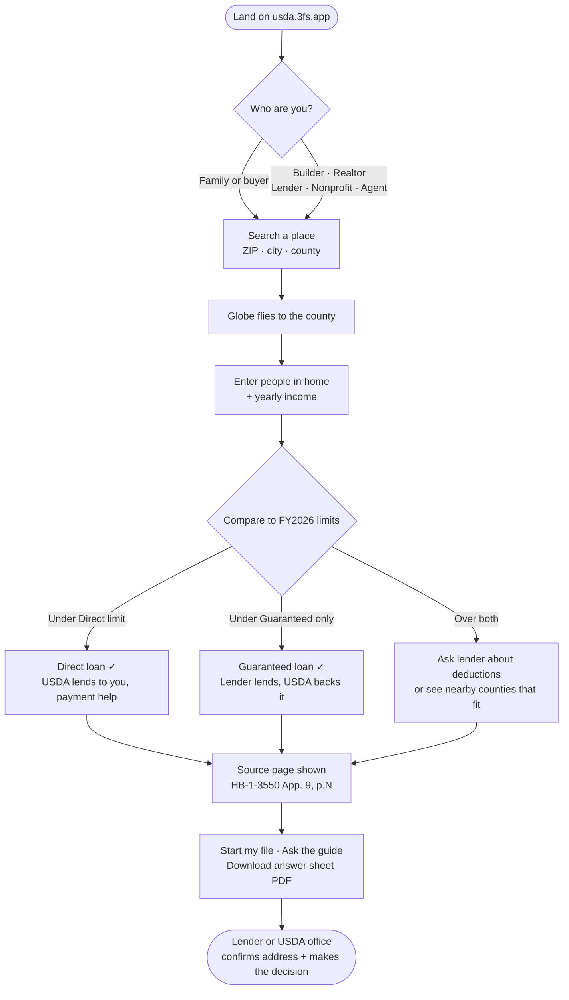
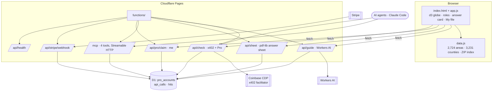

# 3FS Rural Home · usda.3fs.app


**Free USDA rural home loan check for families. A paid API, MCP server and x402 agent rail for everyone else.**

Live: **https://usda.3fs.app** · Parent: https://3fs.app · Operator: UnyKorn LLC · License: MIT

Pick who you are, search a place on the globe, and get the real FY2026 USDA Direct and Guaranteed income limits for that county, with the page of the USDA table each number came from. An AI guide walks people through the rest. Not USDA, not a lender; USDA or an approved lender makes every decision.

[](https://github.com/FTHTrading/usda/actions/workflows/ci.yml)

---

## What a family sees (the flow)



## How the AI guide stays honest

The model is never trusted with a number. The server computes first, the model talks second, and anything it says that is not in the facts is thrown away.

```mermaid
flowchart LR
    U[Person's message<br/>+ on-screen context] --> P[Parse ZIP · people · income]
    P --> C[check&#40;&#41; against the<br/>FY2026 table]
    C --> F[FACTS block<br/>limits 1-4 & 5-8 · page · area type · verdict]
    F --> M[Workers AI<br/>llama-3.3-70b]
    U --> M
    M --> G{Every $ figure and<br/>page number in FACTS?}
    G -->|yes| OK[Answer goes out<br/>grounded: true]
    G -->|no| R[Replace with deterministic<br/>answer built from FACTS<br/>grounded: false]
```



## How it is paid for

```mermaid
flowchart TD
    Q[GET /api/check?zip&people&income] --> K{Authorization:<br/>Bearer rh_…?}
    K -->|valid Pro key| R[200 result<br/>unlimited]
    K -->|no key| X{X-PAYMENT header?}
    X -->|none| P402[402 + accepts&#91;&#93;<br/>$0.02 USDC on Base<br/>payTo 0xFCc1…3cb3]
    X -->|present| V[Coinbase CDP facilitator<br/>verify]
    V -->|ok| C[compute result]
    C --> S[settle on Base]
    S --> R2[200 result<br/>+ x-payment-response]
    V -->|bad| P402

    subgraph Pro
        SL[Stripe Payment Link<br/>$49/mo] --> WH[/api/stripe/webhook<br/>HMAC verified/]
        WH --> D1[(D1 pro_accounts)]
        D1 --> CL[/api/pro/claim<br/>key shown once, hash stored/]
    end
```



Families on the website never hit any of this: the browser does the check locally from `public/data.js`.

## System map



## Data: where every number comes from

| Item | Value |
|---|---|
| Source | USDA HB-1-3550 Appendix 9, FY2026 Adjusted Income Limits, PN 657 (07/13/2026) |
| Fingerprint | SHA-256 `79dcb1f7ee43b76902cc4594055f704864b670aa72b50fbac2fa6886c2bc933c` |
| Areas parsed | 2,724 (every state and territory) |
| Counties mapped | 3,231 (15 metro counties hand-matched) |
| Household math | 1–4 and 5–8 columns from the table; 9+ adds 8% of the 4-person figure per person, rounded to $50 |
| Finding | 2,065 of 2,724 areas use the FY2026 Guaranteed floor: $122,800 (1–4) / $162,100 (5–8) |

Every answer carries the PDF page. The site's Proof section lets anyone fingerprint the PDF themselves.

## Repository layout

```
public/              Static site (Cloudflare Pages output dir)
  index.html app.js data.js    SPA, globe, answer card, guide client
  blog/ sitemap.xml robots.txt llms.txt    SEO / GEO
  brand/ docs/       3FS mark + PDFs with the mark
  terms.html privacy.html about.html 404.html
  _headers           HSTS, CSP, caching
functions/           Pages Functions (edge API)
  _lib.js            check(), whereQualify(), zonesNear(), Pro auth, rate limits
  _data.js           the parsed FY2026 table (server copy)
  _cdp.js            Coinbase CDP JWT (x402 facilitator auth)
  api/check.js       x402 + Pro-key paid check
  api/guide.js       AI guide with server-side grounding and number guard
  api/sheet.js       one-page branded PDF answer sheet
  api/pro/           claim (one-time key), me
  api/stripe/webhook.js
  api/health.js
  mcp.js             MCP server: check_zip, where_qualify, opportunity_zones, program_info
schema.sql           D1 schema
tools/               build scripts (blog, brand, PDFs, SEO head)
tests/               node --test for the limits engine
AUDIT-2026-10-07.md  third-party style health & security audit
LAUNCH-CHECKLIST.md  verification results and manual launch steps
```

## Run it

```bash
npm install
npm test                 # limits engine tests
npm run check            # syntax-check every Function
npx wrangler login
npx wrangler d1 execute usda-3fs --file schema.sql --remote   # once
npm run dev              # local Pages + Functions
npm run deploy           # wrangler pages deploy ./public --project-name usda-3fs
```

Secrets (set with `npx wrangler pages secret put NAME --project-name usda-3fs`): `STRIPE_WEBHOOK_SECRET`, `CDP_API_KEY_ID`, `CDP_API_KEY_SECRET`. Public vars live in `wrangler.toml`.

## Use it from a terminal or an agent

```bash
# Claude Code
claude mcp add --transport http usda-3fs https://usda.3fs.app/mcp

# curl (Mac/Linux)
curl -s 'https://usda.3fs.app/api/check?zip=30513&people=4&income=68000'   # 402 with x402 terms
curl -s -H 'Authorization: Bearer rh_…' 'https://usda.3fs.app/api/check?zip=30513&people=4&income=68000'
```

```powershell
# PowerShell
Invoke-RestMethod 'https://usda.3fs.app/api/health?deep=1'
```

## Pricing

| Who | Price |
|---|---|
| Families and homebuyers | Free |
| Builders, realtors, lenders, nonprofits (Pro) | $49 / month, unlimited key + bulk CSV |
| AI agents | $0.02 per check in USDC on Base (x402) |

## Legal

3FS Rural Home is a technology service by UnyKorn LLC. It is not affiliated with USDA and is not a lender or broker. Terms: https://usda.3fs.app/terms · Privacy: https://usda.3fs.app/privacy

Code: MIT (see LICENSE). USDA data: public domain. 3FS mark and brand assets: trademarks of UnyKorn LLC, not licensed.
