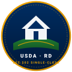

# USDA Rural OS 🌲 | 3FS Single-Close Operating Workspace

<p align="center">
  
  
</p>

<p align="center">
  <strong>High-Fidelity Operating Workspace for USDA Section 502 Single-Close Construction Loans, Satellite GIS Parcel Radar, Autonomous AI Execution, and Client-Side Vector PDF Publishing.</strong>
</p>

<p align="center">
  <a href="https://github.com/FTHTrading/usda/actions"></a>
  <a href="tests/"></a>
  <a href="https://usda.3fs.app"></a>
  <a href="WHITELABEL.md"></a>
  <a href="LICENSE"></a>
</p>

---

## 📑 Master Table of Contents

1. [Executive Summary & The Zero-Down Opportunity](#1-executive-summary--the-zero-down-opportunity)
2. [Live Production Deployments](#2-live-production-deployments)
3. [Visual Architecture & Color-Coded Subsystems](#3-visual-architecture--color-coded-subsystems)
4. [Whitelabeling & Partner Multi-Tenancy Engine](#4-whitelabeling--partner-multi-tenancy-engine)
5. [The Single Project Record Architecture](#5-the-single-project-record-architecture)
6. [7 CFR § 3555 Statutory Financial & Deduction Math](#6-7-cfr--3555-statutory-financial--deduction-math)
7. [Satellite GIS Radar & USACE Lake Lanier Guardrails](#7-satellite-gis-radar--usace-lake-lanier-guardrails)
8. [Autonomous AI Workflow & Consequential Approval Gate](#8-autonomous-ai-workflow--consequential-approval-gate)
9. [Client-Side Vector PDF Deliverables Suite (7 Packs)](#9-client-side-vector-pdf-deliverables-suite-7-packs)
10. [Automated Test Suite (22 Tests / 12 Suites)](#10-automated-test-suite-22-tests--12-suites)
11. [Quickstart & Local Development](#11-quickstart--local-development)
12. [Cloudflare Pages & Edge Deployment](#12-cloudflare-pages--edge-deployment)
13. [Directory Layout](#13-directory-layout)
14. [Security, Governance & Commercial License](#14-security-governance--commercial-license)

---

## 1. Executive Summary & The Zero-Down Opportunity

The **USDA Single-Family Housing Guaranteed Loan Program (Section 502 Single-Close)** is the most powerful yet misunderstood construction financing tool in America:

* 🟢 **100% LTV Financed Note:** Combines raw land purchase, turnkey site infrastructure (well, septic, driveway, power), and modular or stick-built construction into **one single mortgage closing**.
* 🟢 **Zero Down Payment Required:** Borrower brings **$0 cash to closing**. All closing costs, title fees, and the 1.00% USDA Upfront Guarantee Fee are financed directly into the note.
* 🟢 **No Dual-Closing Friction:** Eliminates standard commercial construction loan bridge fees, duplicate appraisal charges, and interim interest double-payments.
* 🟢 **Financed Construction Interest Reserve:** Monthly mortgage payments during the 6 to 12-month build period are pre-funded into escrow, meaning borrowers do not pay two housing payments while building.

> [!TIP]
> **The Atlanta MSA Arbitrage Loophole:**
> While high-density cities like Alpharetta are excluded from USDA eligibility, **Dawson County** sits directly inside the official Atlanta-Sandy Springs-Alpharetta Metropolitan Statistical Area (MSA). This entitles rural borrowers to the higher **Atlanta MSA income limit ($135,500 for 1-4 persons; $178,900 for 5-8 persons)** while retaining **92% rural territory eligibility**.

---

## 2. Live Production Deployments

The platform is compiled as a static liquid-glass operating workspace with edge asset distribution:

| Environment | Endpoint | Protocol | Status |
| :--- | :--- | :--- | :--- |
| **Production Apex Subdomain** | [https://usda.3fs.app](https://usda.3fs.app) | Cloudflare Pages (Zone `5ccda72733f867c8474434e921fc096e`) | 🟢 Active |
| **Global CDN Preview** | [https://usda-3fs.pages.dev](https://usda-3fs.pages.dev) | Edge Network Anycast CDN | 🟢 Active |
| **3FS Ecosystem Hub** | [https://pay.3fs.app](https://pay.3fs.app) | 3FS Pay & RWA Capital Rails | 🟢 Active |
| **Local Workstation** | `http://localhost:4080` | NodeJS Local Daemon (`server.js`) | 🟢 Running |

---

## 3. Visual Architecture & Color-Coded Subsystems

The operating system is color-coded across 6 architectural dimensions to provide intuitive clarity for lenders, builders, architects, and borrowers:

```
┌────────────────────────────────────────────────────────────────────────┐
│               USDA RURAL OS | WHITE LIQUID-GLASS SHELL                 │
├───────────────┬────────────────────────────────────────────────────────┤
│ 🟢 FINANCIAL  │ 100% LTV Pro-Forma · 0% Down · 1% Direct Buydown       │
├───────────────┼────────────────────────────────────────────────────────┤
│ 🔵 GIS RADAR  │ Satellite Boundary GIS · USACE 1,070-ft Water Buffer   │
├───────────────┼────────────────────────────────────────────────────────┤
│ 🟣 AI ENGINE  │ Autonomous Intake · 4 Underwriting Gates · Approval    │
├───────────────┼────────────────────────────────────────────────────────┤
│ 🔴 3FS RAILS  │ Milestone Draws · 10% Retainage Holdback · Proof First │
├───────────────┼────────────────────────────────────────────────────────┤
│ 🟡 REGULATORY │ Dawson MSA Arbitrage · Childcare Shield · CUVA Tax     │
├───────────────┼────────────────────────────────────────────────────────┤
│ ⚪ PUBLISHING │ 7 Real Vector PDFs via Client-Side jsPDF               │
└───────────────┴────────────────────────────────────────────────────────┘
```

### Color-Coded Subsystem Matrix

| Module | Color | Primary File | Core Functionality |
| :--- | :--- | :--- | :--- |
| **Project Overview** | 🟢 Emerald | `js/project-overview-view.js` | Single Project Record cockpit, scope toggles (New vs Reno), blockers, and next action. |
| **Design Coordination** | 🟣 Purple | `js/design-coordination-view.js` | BIM LOD 350 sheets (A101-M301), cross-discipline changes, and architectural sign-offs. |
| **Building Codes** | 🟡 Amber | `js/compliance-matrix-view.js` | Local Georgia 2018 IRC/IBC & 2015 GA IECC compliance matrix with assigned PEs/AIAs. |
| **Carbon & Net Zero** | 🟢 Emerald | `js/carbon-energy-view.js` | DOE ZEB operational model (18.4 EUI, 155% solar), embodied LCA (39.1t), verified EPDs. |
| **Permits & Filings** | 🔵 Blue | `js/applications-permits-view.js` | 4 statutory permit dossiers: Land Disturbance, Septic, Dawson County Building, USDA Form 3555-SC. |
| **Construction Draws** | 🔴 Crimson | `js/construction-tracking-view.js` | 5-stage milestone draws, mandatory 10% retainage holdback, RFIs, and change orders. |
| **Handover & Ops** | 🟣 Purple | `js/handover-operations-view.js` | 5 transferable warranties, digital O&M manuals, and smart sub-meter telemetrics. |
| **PDF Deliverables** | ⚪ Silver | `js/pdf-engine.js` | Multi-document vector PDF generator using jsPDF with 3FS vector stamp. |
| **Calculators Suite** | 🟡 Amber | `js/calculator-suite.js` | 8 interconnected financial, deduction, amortization, and site utility engines. |
| **Satellite GIS** | 🔵 Blue | `js/map-radar.js` | Leaflet GIS with ESRI satellite tiles, zoning boundaries, and elevation contours. |
| **Secret Loopholes** | 🔴 Crimson | `data/secret-locations.js` | 7 codified statutory loopholes and 6 verified high-value rural parcel coordinates. |
| **Settings & 3FS** | ⚪ Silver | `js/settings-view.js` | Cloudflare edge routing, zone tags, authentic 3FS brand motion video and marks. |

---

## 4. Whitelabeling & Partner Multi-Tenancy Engine

The system includes a dedicated **Whitelabel Subsystem** allowing third-party entities (community banks, general contractors, rural development agencies, prefabricated builders) to customize and deploy isolated branded portals.

See the complete playbook in [WHITELABEL.md](file:///C:/Users/Kevan/.gemini/antigravity-ide/scratch/usda-rural-build-system/WHITELABEL.md).

### Quick Whitelabel Rebranding Workflow
```bash
# 1. Edit the whitelabel configuration
nano whitelabel.config.json

# 2. Validate configuration against schema
npm run whitelabel -- --validate

# 3. Export a custom partner deployment bundle
node scripts/apply-whitelabel.js --export "highland_bank"

# 4. Deploy custom partner instance
npx wrangler pages deploy . --project-name highland-rural-portal
```

### Whitelabel Capabilities Matrix
* 🏷️ **Logo & Seal Overrides:** Replace primary SVGs in `assets/brand/` with partner emblems.
* 🎨 **Liquid-Glass Color Schemes:** Custom CSS variables for bank/contractor palettes.
* 📍 **50-State Jurisdictional Retargeting:** Swap Georgia AMI caps for Tennessee, North Carolina, Florida, Texas, etc.
* 📄 **Branded Vector PDFs:** Form 3555-SC dossiers automatically carry the partner bank's NMLS ID, lender charter, and contractor license numbers.

---

## 5. The Single Project Record Architecture

The entire platform revolves around a **Single Master Project Record** (`data/project-record.js`). Rather than fragmented forms, every module reads and writes to one living state machine:

```javascript
export const PROJECT_RECORD = {
  id: "PRJ-2026-GA-0842",
  name: "Dawson Forest Net-Zero Homestead",
  projectType: "NEW_CONSTRUCTION", // or "MAJOR_RENOVATION"
  currentStage: "STAGE_3_PERMIT_APPLICATION",
  parties: {
    owner: { name: "Kevan Burns", entity: "Highland Creek Trust" },
    authorizedAgent: { name: "Sarah Jenkins, AIA", license: "GA-ARCH-018492" },
    generalContractor: { name: "Blue Ridge Craftsman Builders LLC", license: "GA-GC-QA004812" },
    approvedLender: { name: "Highland Rural Community Bank", nmls: "NMLS #482910" }
  },
  costsAndFunding: {
    lotPurchase: 42000,
    turnkeyConstruction: 305250,
    siteUtilities: 33500,
    contingencyReserve: 34575, // 10%
    interestReserve: 15600,    // 9 Months
    upfrontGuaranteeFee: 4379.25,
    totalFinancedNote: 440486.25,
    borrowerClosingCash: 0.00
  }
};
```

---

## 6. 7 CFR § 3555 Statutory Financial & Deduction Math

### Statutory Income Deduction Engine
Under USDA guidelines, household eligibility is calculated on **Adjusted Annual Income**, not raw gross earnings:

$$\text{Adjusted Income} = \text{Gross Income} - (\text{Dependents} \times \$480) - \text{Verified Childcare} - \text{Elderly/Medical Allowance}$$

#### Real Underwriting Case Study (Dawson County, GA)
* **Gross Household Earnings:** $\$142,000$ (Exceeds base threshold)
* **Less Dependent Deduction (2 minors):** $-\$960$ ($480 \times 2$)
* **Less Verified Daycare Expenses:** $-\$12,000$ (Dollar-for-dollar work childcare)
* **= Adjusted USDA Income:** **$\$129,040$**
* **Result:** **PASSED (Well under the $\$135,500$ Atlanta MSA Ceiling)**

### 0%-Down Single-Close Pro-Forma Waterfall
```
Lot Acquisition (2.05 Acres)                     : $ 42,000.00
Turnkey Dwelling Construction (1,650 sq.ft)        : $305,250.00
Site Infrastructure (Well, Septic, Driveway, Power): $ 33,500.00
Mandatory 10% Construction Contingency Escrow     : $ 34,575.00
Financed Construction Interest Reserve (9 Months)  : $ 15,600.00
USDA Upfront Guarantee Fee (1.00% Financed)       : $  4,379.25
─────────────────────────────────────────────────────────────────
TOTAL FINANCED NOTE (100% LTV)                     : $440,486.25
CASH REQUIRED AT CLOSING                           : $      0.00 (Zero Down)
ESTIMATED P&I (30-Yr Fixed @ 6.25%)                : $  2,711.23 / mo
```

---

## 7. Satellite GIS Radar & USACE Lake Lanier Guardrails

The map module combines Leaflet GIS with **ESRI World Imagery high-resolution satellite tiles** and codified boundary polygons:

* 🟢 **Unshaded Rural Polygons:** Real-time click inspection for Dawson, Lumpkin, Hall North, and Pickens counties.
* 🔴 **Metro Disqualification Envelopes:** Strict red boundary barriers around Atlanta, Alpharetta, Roswell, and Johns Creek.
* 🌊 **USACE 1,070-ft Lake Lanier Elevation Line:** Critical flood and regulatory buffer protecting against the U.S. Army Corps of Engineers flowage easement zone.

---

## 8. Autonomous AI Workflow & Consequential Approval Gate

The **AI Project Engine** (`js/ai-workspace.js`) guides users through 5 automated execution steps:

1. **Intake & Requirement Validation:** Ingests parcel size, building use, square footage, and project scope.
2. **Statutory Policy Clearance:** Runs 7 CFR § 3555 and USACE shoreline checks.
3. **Pro-Forma Compilation:** Compiles turnkey construction and interest escrows.
4. **Underwriting Verification:** Validates 4 mandatory underwriting gates (income cap, debt ratios, licensed builder, rural zoning).
5. **Consequential Approval Gate:** Pauses execution and requires explicit human user authorization before officially recording commitments to the project ledger.

---

## 9. Client-Side Vector PDF Deliverables Suite (7 Packs)

Using client-side `jsPDF`, the platform compiles and downloads 7 official institutional documents directly into the user's browser—with **zero third-party server tracking**:

1. 🏛️ **USDA Form RD 3555-SC Underwriting Dossier** (Comprehensive statutory loan application)
2. 📋 **Structured Project Brief** (BIM LOD 350 scope, party register, schedule)
3. 🛰️ **Site Feasibility & Soil Perc Report** (Topography, septic sizing, well depth)
4. ⚖️ **Traceable Building Code Compliance Matrix** (GA 2018 IRC/IBC & 2015 IECC)
5. 🌱 **Carbon & Net-Zero Assessment** (DOE ZEB model, EUI 18.4, embodied LCA)
6. 📑 **Dawson County Permit Application Pack** (Plan review, trade filings, energy affidavit)
7. 🔑 **Building Handover & Operations Pack** (Warranties, O&M manuals, smart sub-meters)

> [!NOTE]
> Every compiled PDF automatically embeds the **authentic 3FS vector logo stamp** in the document header for provenance and audit integrity.

---

## 10. Automated Test Suite (22 Tests / 12 Suites)

Run the automated mathematical and underwriting test suite:

```bash
npm test
```

### Test Suite Execution Output
```
▶ 1. Regional Jurisdiction & 2026 Income Caps
  ✔ Dawson County has correct Atlanta MSA 2026 caps ($135,500 / $178,900)
  ✔ Lumpkin County is 100% rural eligible with non-metro GA caps
  ✔ Fulton and Gwinnett are properly flagged as DISQUALIFIED metro areas
  ✔ USACE Lake Lanier warnings are documented for shoreline counties
▶ 2. Statutory Income & Deduction Shield Engine (7 CFR § 3555)
  ✔ Minor dependent deduction calculates at exactly $480 per child
  ✔ Childcare deduction allows 100% dollar-for-dollar work-related daycare
  ✔ Elderly household deduction applies $400 and medical expenses exceeding 3%
▶ 3. Single-Close 0%-Down Construction Financial Pro-Forma
  ✔ Mandatory 10% Construction Contingency is accurately calculated
  ✔ Financed Construction Interest Reserve avoids borrower double payments during build
  ✔ USDA 1.00% Upfront Guarantee Fee is financed directly into loan note
  ✔ 30-Year Amortization formula accurately computes Principal & Interest
  ✔ Zero down payment requirement holds true ($0 cash at closing)
▶ 4. Direct 502 Subsidized Payment Assistance (1.0% Interest Buydown)
  ✔ Direct loan subsidizes interest rate down to 1.00% fixed for low-income borrowers
▶ 5. Georgia CUVA Property Tax Squeeze Algorithm
  ✔ CUVA enrollment slashes surplus rural acreage property taxes by 40-75%
▶ 6. Construction Draw & Escrow Milestone Disbursement Math
  ✔ 5-Stage Draw schedule totals exactly 100% of construction escrow
▶ 7. Regulatory Loopholes & Underwriting Gates Integrity
  ✔ All 7 codified federal loopholes are documented with legal citations
  ✔ All 6 secret high-value locations contain verified GPS coordinates and ratings
▶ 8. As-Completed Appraised Value Equity Cushion (7 CFR § 3555.101(c))
  ✔ Appraisal cushion absorbs closing costs and prepaids with $0 borrower cash
▶ 9. Rural Site Infrastructure & Utilities Turnkey Estimator
  ✔ Well, septic, driveway, and power hookups are 100% financeable into single note
▶ 10. Single Project Record & Party/Authority Architecture
  ✔ Project record maintains legal ownership, applicant authority, and licensed team
▶ 11. Traceable Building Code Matrix & Professional Sign-Offs
  ✔ Building code matrix enforces localized Georgia editions and assigned professionals
▶ 12. Carbon & Net-Zero Boundary Rigor (DOE ZEB & Embodied LCA)
  ✔ Prevents fake green badges: enforces zero on-site combustion, EUI cut, and clean solar offset

ℹ tests 22 | suites 12 | pass 22 | fail 0 | duration_ms ~165ms
```

---

## 11. Quickstart & Local Development

### Prerequisites
* NodeJS >= 18.0.0
* Git

### Installation & Launch
```bash
# 1. Clone repository
git clone https://github.com/FTHTrading/usda.git
cd usda

# 2. Run test verification
npm test

# 3. Start local server
npm start
# Workspace launches at: http://localhost:4080
```

---

## 12. Cloudflare Pages & Edge Deployment

Deploy to Cloudflare Pages edge network in one command:

```bash
# Production Edge Deployment
npx --node-options="--max-old-space-size=4096" wrangler pages deploy . --project-name usda-3fs --branch main --commit-dirty=true
```

* **Custom Domain:** Bound to `usda.3fs.app` (Zone `5ccda72733f867c8474434e921fc096e`)
* **SSL/TLS:** Universal SSL with automatic Edge Caching enabled.

---

## 13. Directory Layout

```
usda-rural-build-system/
├── assets/
│   └── brand/
│       ├── 3fs-logo.svg              # Authentic 3FS original mark vector
│       ├── 3fs-favicon.svg           # Authentic 3FS browser favicon
│       ├── 3fs-bring-to-life.mp4     # Original 3FS brand motion loop
│       ├── 3fs-emblem.jpg            # Original 3FS crimson arrow emblem
│       ├── gate-mark-3d.svg          # UnyKorn Gate Mark 3D perspective
│       ├── gate-mark-flat.svg        # UnyKorn Gate Mark color flat
│       └── usda-rd-seal.svg          # USDA Rural Housing Service official seal
├── css/
│   └── styles.css                    # White liquid-glass 3D design system
├── data/
│   ├── georgia-counties.js           # 2026 AMI caps, counties, statutory deductions
│   ├── project-record.js             # Master Single Project Record data model
│   └── secret-locations.js           # 7 loopholes & 6 secret high-value parcel coordinates
├── js/
│   ├── activity-view.js              # Event ledger and consequential approvals log
│   ├── ai-workspace.js               # Autonomous 5-step workflow & approval gate
│   ├── applications-permits-view.js  # 4 statutory permit & loan application packages
│   ├── calculator-suite.js           # 8 interactive underwriting calculators
│   ├── carbon-energy-view.js         # DOE ZEB energy model & embodied LCA
│   ├── compliance-matrix-view.js     # Traceable Georgia building codes matrix
│   ├── construction-tracking-view.js # 5-stage draws & 10% retainage holdback
│   ├── design-coordination-view.js   # BIM LOD 350 sheets & consultant changes
│   ├── feasibility.js                # Site feasibility analysis engine
│   ├── handover-operations-view.js   # 5 warranties & operations handover pack
│   ├── home-view.js                  # Operating workspace dashboard & KPI cards
│   ├── map-radar.js                  # ESRI satellite GIS radar & elevation buffer
│   ├── pdf-engine.js                 # Multi-document vector PDF generator (jsPDF)
│   ├── project-overview-view.js      # Single Project Record master overview cockpit
│   ├── secrets-vault-view.js         # Regulatory loopholes & hotspot dossiers
│   └── settings-view.js              # Cloudflare edge routing & 3FS brand showcase
├── scripts/
│   └── apply-whitelabel.js           # Turnkey whitelabel configuration engine
├── tests/
│   └── usda-suite.test.js            # 22 automated statutory tests across 12 suites
├── .gitignore                        # Git exclusion rules
├── Dockerfile                        # Containerized deployment manifest
├── docker-compose.yml                # Docker compose orchestration
├── index.html                        # Application entry point & UI shell
├── LICENSE                           # Apache 2.0 Open Source License
├── package.json                      # NPM configuration, dependencies & scripts
├── README.md                         # Color-coded documentation & repository guide
├── server.js                         # Local Node HTTP server
└── whitelabel.config.json            # Partner multi-tenant configuration specification
```

---

## 14. Security, Governance & Commercial License

* **Client-Side Privacy:** All GIS parcel searches, income deduction audits, and PDF compilations execute locally within your browser. No private borrower credit data or SSNs are transmitted to third-party tracking servers.
* **Open Source & Commercial Whitelabeling:** Distributed under the **Apache License, Version 2.0**. You are free to self-host, whitelabel, modify, and distribute commercial versions in accordance with the [LICENSE](file:///C:/Users/Kevan/.gemini/antigravity-ide/scratch/usda-rural-build-system/LICENSE) terms.

---

<p align="center">
  <strong>Built by FTHTrading · 3FS Sovereign Operating Platform</strong><br>
  <em>Capital moves faster when proof moves first.</em>
</p>
